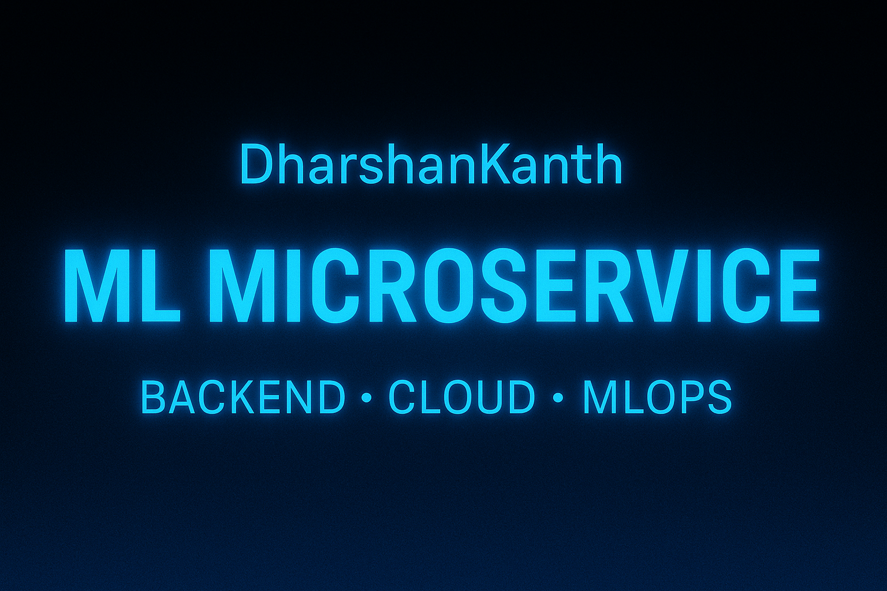
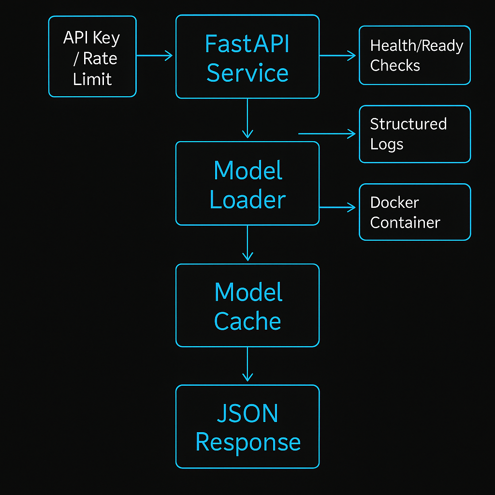

<p align="center">
  
</p>

# **ML Microservice**


A lightweight, production-style ML inference microservice built using **FastAPI** and **Docker**.
The service loads a trained model, caches it, exposes versioned prediction endpoints, and includes health checks, structured logs, rate limiting, and environment-based configuration.

This project demonstrates how a simple ML model becomes a **deployable, maintainable microservice** suitable for real production workflows.

---

## **Quick Start**

```bash
docker build -t ml-api .
docker run -p 8000:8000 ml-api
```

Open interactive API docs:

```
http://127.0.0.1:8000/docs
```

---

## **Purpose**

Most ML workflows stop at training.
This project focuses on **deployment engineering**:

* deterministic model loading
* versioning support
* structured logging
* production health checks
* lightweight containerized delivery

It follows patterns commonly used in DevOps/MMLOps environments.

---

## **Architecture Overview**

```
Client
  |
  v
FastAPI Service
  |
  |-- selects model version
  |-- loads model (cached)
  |
  v
Model Inference
  |
  v
JSON Response
```
<p align="center">
  
</p>


Key internal components include:

* model cache to avoid repeated disk loads
* versioned model storage
* request logging middleware
* millisecond latency tracking
* `/health` and `/ready` probes
* optional API-key authentication

---

## **Features**

### **Model Serving**

* Supports multiple versions (`v1`, `v2`, …)
* Joblib-based model loading
* In-memory model cache for performance

### **Observability**

* JSON-formatted logs
* Records method, URL, client IP, latency
* Suitable for log aggregators

### **Health / Readiness**

* `/health` → service is running
* `/ready` → model inference works

### **Configuration**

* `.env` driven
* Pydantic settings validation

### **Security**

* Optional API key authentication

### **Containerization**

* Multi-stage Docker build
* Small runtime image
* Built-in `HEALTHCHECK`

---

## **Project Structure**

```
ml-api/
 ├── app/
 │   ├── main.py
 │   ├── config.py
 │   ├── logger.py
 │   ├── models/
 │   │   ├── v1.joblib
 │   ├── requirements.txt
 ├── train_model.py
 ├── Dockerfile
 ├── .env.example
 ├── README.md
```

---

## **API Usage Examples**

### **1. cURL**

```bash
curl -X POST "http://localhost:8000/predict?version=v1" \
  -H "Content-Type: application/json" \
  -H "api-key: secret123" \
  -d '{"sepal_length":5.1,"sepal_width":3.5,"petal_length":1.4,"petal_width":0.2}'
```

---

### **2. Python**

```python
import requests

data = {
    "sepal_length": 5.1,
    "sepal_width": 3.5,
    "petal_length": 1.4,
    "petal_width": 0.2
}

res = requests.post(
    "http://localhost:8000/predict?version=v1",
    json=data,
    headers={"api-key": "secret123"}
)

print(res.json())
```

---

### **3. JavaScript**

```javascript
fetch("http://localhost:8000/predict?version=v1", {
  method: "POST",
  headers: {
    "Content-Type": "application/json",
    "api-key": "secret123"
  },
  body: JSON.stringify({
    sepal_length: 5.1,
    sepal_width: 3.5,
    petal_length: 1.4,
    petal_width: 0.2
  })
})
.then(res => res.json())
.then(data => console.log(data));
```

---

## **Training a Model**

```bash
python train_model.py
```

This generates model files such as:

```
app/models/v1.joblib
```

You can produce new model versions by retraining and saving them under different version names.

---

## **Environment Variables**

`.env.example`:

```
APP_NAME="ML Prediction API"
APP_VERSION="1.0"
MODEL_DIR="app/models"
DEFAULT_VERSION="v1"
API_KEY="secret123"
```

---

## **Troubleshooting**

### **Model not found**

* Check that the `.joblib` file exists under `app/models/`
* Ensure the `MODEL_DIR` value matches your folder structure

### **Container marked unhealthy**

* Confirm `/health` is reachable inside the container

### **Prediction errors**

* Inputs must contain exactly 4 numerical features

---

## **Author**

DharshanKanth

---


